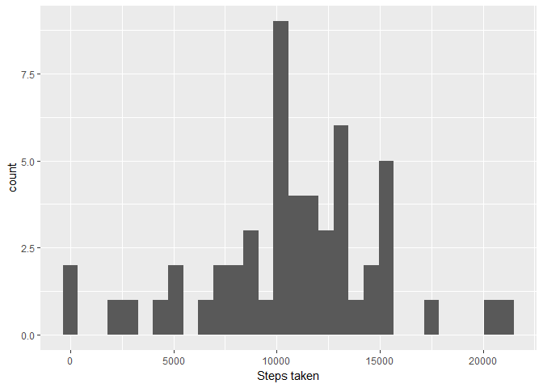
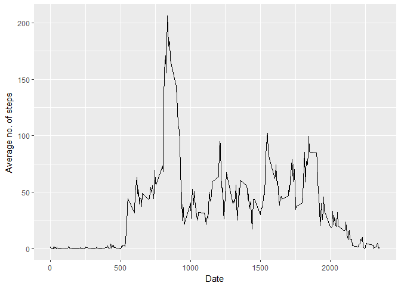
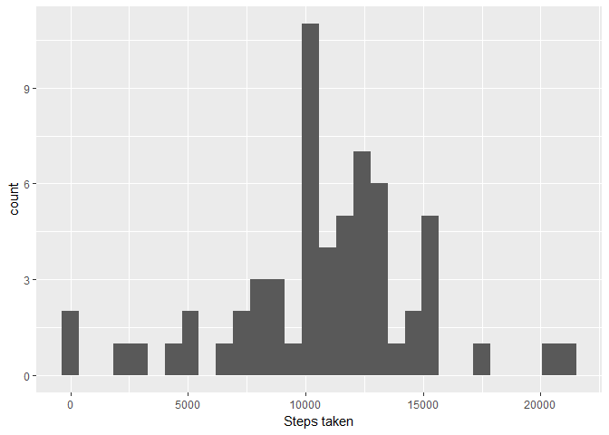
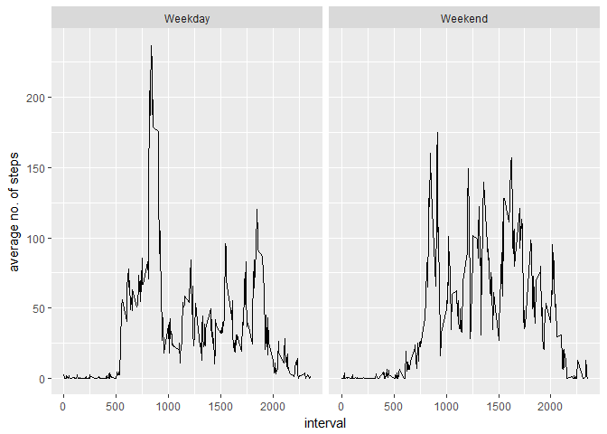

# Reproducible Research: Peer Assessment 1


## Loading and preprocessing the data
we first read the data using the following code

```r
activity <- read.csv("activity.csv")
```


## What is mean total number of steps taken per day?


```r
library(ggplot2)
```

```
## Warning: package 'ggplot2' was built under R version 3.3.2
```

```r
#aggregating on basis of steps per days
dwise<-aggregate(steps~date,sum,data=activity)
qplot(dwise$steps,xlab = "Steps taken",geom = "histogram")
```

```
## `stat_bin()` using `bins = 30`. Pick better value with `binwidth`.
```

<!-- -->


### mean

```r
mean(dwise$steps)
```

```
## [1] 10766.19
```
### median

```r
median(dwise$steps)
```

```
## [1] 10765
```


## What is the average daily activity pattern?

Average daily activity is being represented in form of a time series plot as shown below

```r
dwise_avg<- aggregate(steps~interval,mean,data = activity)

qplot(dwise_avg$interval,dwise_avg$steps,xlab="Date",ylab="Average no. of steps",geom="line")
```

<!-- -->
### Maximum activity interval is 

```r
dwise_avg$interval[which.max(dwise_avg$steps)]
```

```
## [1] 835
```
looks like most people prefer to exercise in the morning

## Imputing missing values
### Number of rows with missing values is given below

```r
sum(is.na(activity$steps))
```

```
## [1] 2304
```
### imputing the missing values 

Our strategy to impute the missing values is to substitute them with their respective average values on those particular days.

For this we need to calculate the avergae which is a combibation of the interval and day

```r
activity1<-activity
activity1$day <- weekdays(as.Date(activity1$date))
daywise_avg<-aggregate(steps ~ interval+day,mean,data=activity1)

activity1 <- merge(activity1,daywise_avg,by=c("interval","day"))
i<-1
for ( i in 1:nrow(activity1)){
        if (is.na(activity1$steps.x[i])){
                activity1$steps.x[i]<-activity1$steps.y[i]
        }
        i<i+1
}

dwise1<-aggregate(steps.x~date,sum,data=activity1)
qplot(dwise1$steps.x,xlab = "Steps taken",geom = "histogram")
```

```
## `stat_bin()` using `bins = 30`. Pick better value with `binwidth`.
```

<!-- -->

There is a difference after imputing the missing values. If we observe carefully the histogram before and after imputing the missing values we can notice a spike in the frequency of the steps taken per day for values around 10000. Even the mean and median values have changed from the previous values.

### mean

```r
mean(dwise1$steps.x)
```

```
## [1] 10821.21
```
previous value of mean was [10766.19]

### median

```r
median(dwise1$steps.x)
```

```
## [1] 11015
```
previous value of mean was [10765]

## Are there differences in activity patterns between weekdays and weekends?


```r
activity1$weekday <- character(17568)
i<-1
for (i in 1:nrow(activity1)){
        if(activity1$day[i] == "Saturday" | activity1$day[i] == "Sunday" ) {
                activity1$weekday[i] <- "Weekend"
        } else {
                activity1$weekday[i] <- "Weekday"     
        }
        
}

weekday_avg <- aggregate(steps.x~interval+weekday,mean,data = activity1)
qplot(interval,steps.x,facets = .~weekday,data=weekday_avg,geom="line",ylab="average no. of steps")
```

<!-- -->

*From the histograms we deduce that the activity is on higher side on the weekdays. This might be because of the opportunity to do extra besides normal daily work.*
